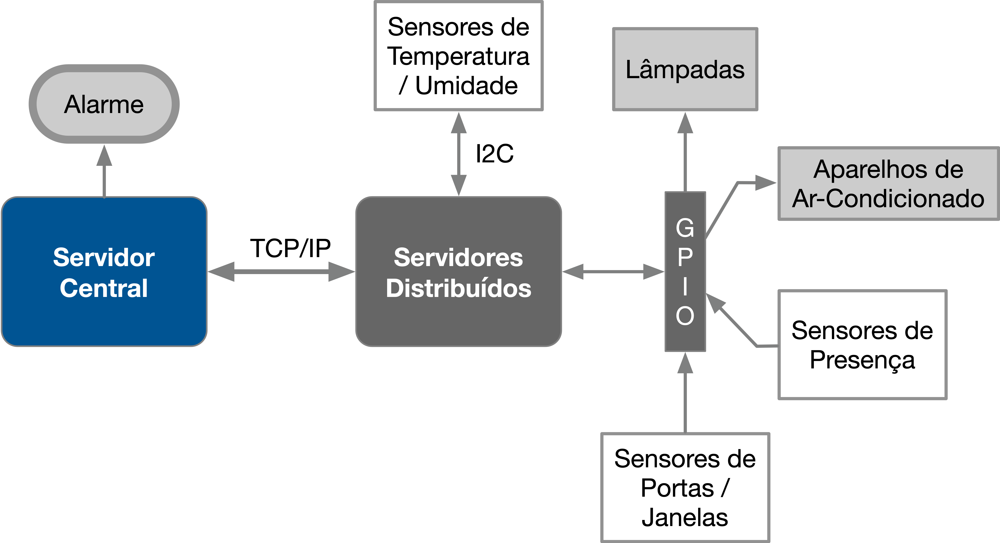

# Projeto 2

Projeto 2 da disciplina de Fundamentos de Sistemas Embarcados (2020/1)

## 1. Objetivos

Este trabalho tem por objetivo a criação de um sistema distribuído de automação residencial para controle e monitoramento de sensores e dispositivos. O sistema deve ser desenvolvido para funcionar em um conjunto de placas Raspberry Pi com um servidor central responsável pelo controle e interface com o usuário e servidores distribuídos para leitura e acionamento dos dispositivos. Dentre os dispositivos envolvidos estão o monitoramento de temperatura, sensores de presença, sensores de abertura e fechamento de portas e janelas, acionamento de lâmpadas, aparelhos de ar-condicionado e alarme.

## 2. Componentes do Sistema

Para simplificar o trabalho, neste caso somente serão utilizados um servidor central e um servidor distribuído.

O sistema do Servidor Central será composto por:
1. 01 Placa Raspberry Pi 4;
2. Saída de som (caixa de som para alerme);

O sistema do Servidor Distribuído será composto por:
1. 01 Placa Raspberry Pi 4;
2. 01 Sensor BME280 (I2C) para a medição da temperatura / umidade;
3. Circuito de potência com 6 relés para acionametno de Lâmpadas / Aparelhos de Ar-Condicionado;
4. 06 Sensores de fechamento de portas/janelas;
5. 02 sensores de presença;
6. 06 sensores de portas / janelas

## 3. Conexões entre os módulos do sistema

1. Os servidores deverão se comunicar através do Protocolo TCP/IP;
2. O alarme do servidor Central deverá ser acionado tocando um arquivo de áudio pela saída de som da própria placa (Uma opção é o uso do omxplayer - https://www.raspberrypi.org/documentation/usage/audio/);
3. O sensor de temperatura BM280 está ligado ao barramento I2C do servidor distribuído e utiliza o endereço (0x76);
4. As lâmpadas, aparelhos de ar, sensores de presença, de portas e janelas estão ligados aos pinos da GPIO conforme a Tabela 1.

| Item                                 | GPIO |
|--------------------------------------|:----:|
| Lâmpada 01 (Cozinha)                 |  17  |
| Lâmpada 02 (Sala)                    |  18  |
| Lâmpada 03 (Quarto 01)               |  27  |
| Lâmpada 04 (Quarto 02)               |  22  |
| Ar-Condicionado 01 (Quarto 01)       |  23  |
| Ar-Condicionado 02 (Quarto 02)       |  24  |
| Sensor de Presença 01 (Sala)         |  25  |
| Sensor de Presença 02 (Cozinha)      |  26  |
| Sensor Abertura 01 (Porta Cozinha)   |  05  |
| Sensor Abertura 02 (Janela Cozinha)  |  06  |
| Sensor Abertura 03 (Porta Sala)      |  12  |
| Sensor Abertura 04 (Janela Sala)     |  16  |
| Sensor Abertura 05 (Janela Quarto 01)|  20  |
| Sensor Abertura 06 (Janela Quarto 02)|  21  |

## 4. Requisitos

Os sistema de controle possui os seguintes requisitos:
1. O código do Servidor Distribuído deve ser desenvolvido em C/C++;
2. O código do Servidor Central pode ser desenvolvido em Python, C ou C++;
3. O servidor central tem as seguintes responsabilidades:  
    3.1 Manter conexão com o servidor distribuído;  
    3.2 Prover uma interface que mantenha o usuário atualizado sobre o estado de cada dispositivo (atualizado a cada 1 segundo), incluindo a temperatura e umidade;  
    3.3 Prover mecanismo para que o usuário possa acionar manualmente lâmpadas e aparelhos de ar-condicionado;  
    3.4 Prover mecanismo para que o usuário possa definir uma temperatura desejada em que ambos os aparelhos de ar-condicionado deverão ser controlados (Controle on/off) em torno desta temperatura).  
    3.5 Prover mecanismo para acionamento de uma alarme que, quando estiver ligado, deve tocar um som de alerta ao detectar presenças ou abertura de portas/janelas;  
    3.6 Manter log (Em arqvuio CSV) dos comandos acionados pelos usuários e do acionamento dos alarmes;  
4. O Servidor distribuído deve fazer interface direta com os dispositivos com as seguintes responsabilidades;  
    4.1 Manter os valores de temperatura / umidade atualizados a cada 1 segundo;  
    4.2 Acionar Lâmpadas e Aparelhos de Ar-Condicionado (mantendo informação sobre seu estado) conforme comandos do Servidor Central;  
    4.3 Manter o estado dos sensores de presença / abertura de portas/janelas informando ao servidor central imediatamente (mensagem push) quando detectar o acionamento de qualquer um deles;  
5. Os códigos em C/C++ devem possuir Makefile para compilação;
6. Descrever no README do repositório o modo de instalação/execução e o modo de uso do programa.

## 5. Critérios de Avaliação

A avaliação será realizada seguindo os seguintes critérios:

|   ITEM    |   DETALHE  |   VALOR   |
|-----------|------------|:---------:|
|**Servidor Central**    |       |       |
|**Comunicação TCP/IP**  |   Correta implementação de comunicação entre os servidores usando o protocolo TCP/IP. |   2,0   |
|**Interface com o estado**  |   Interface (linha de comando) apresentando o estado de cada dispositivo, a temperatura e a umidade.  |   1,0   |
|**Interface (Acionamento)** |   Mecanismo para acionamento de dispositivos, definição de temperatura do Ar. |   1,0   |
|**Acionamento do Alarme**   |   Mecanismo de ligar/desligar alarme e acionamento do alarme de acordo com o estado dos sensores. |   1,0   |
|**Log (CSV)**   |   Geração de Log em arquivo CSV.  |   0,5 |
|**Servidor Distribuído**    |       |       |
|**Leitura de Temperatura / Umidade**    |   Leitura e armazenamento dos valores de temperatura / umidade a cada 1 segundo.  |   1,0   |
|**Acionamento de Dispositivos** |   Correto acionamento de lâmpadas e aparelhos de ar-condicionado pelo comando do Servidor Central.    |   1,0   |
|**Estado dos Sensores** |   Enviar como mensagem (Push) para o Servidor Central um alerta pelo acionamento dos sensores de presença / abertura de portas/janelas.   |   1,0  |
|**Qualidade do Código** |   Utilização de boas práticas como o uso de bons nomes, modularização e organização em geral. |   1,5 |
|**Pontuação Extra** |   Qualidade e usabilidade acima da média. |   1,0   |

## 6. Referências

[Driver da Bosh para o sensor BME280](https://github.com/BoschSensortec/BME280_driver)

[Biblioteca BCM2835 - GPIO](http://www.airspayce.com/mikem/bcm2835/)
